<p align="center">
  
</p>

# Diagram Skills

Agent skills that turn a title, a few notes, or a hot take into a minimalist technical diagram — the right format for the destination, no AI slop, checked before it reaches you.

[](https://github.com/Paldom/diagram-skills/actions/workflows/ci.yml)
[](LICENSE)
[](https://skills.sh/Paldom/diagram-skills)

## Demo

<p align="center">
  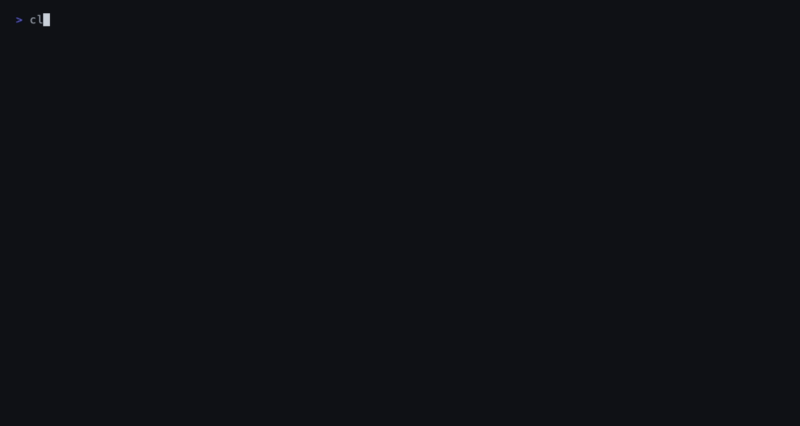
</p>

The recording above is a real headless run of the routing step (source: `assets/demo.tape`, regenerate with `vhs assets/demo.tape`): one ask in, a one-page brief out — the takeaway, the entities and relations, and the format decision with its reason.

What a real headless `/illustrate` run returned for the ask in the tape above (verdict PASS, second opinion from a different model included). The model wrote the title, the subtitle and six labels; the grid, sizes, and contrast came from the compiler:

<p align="center">
  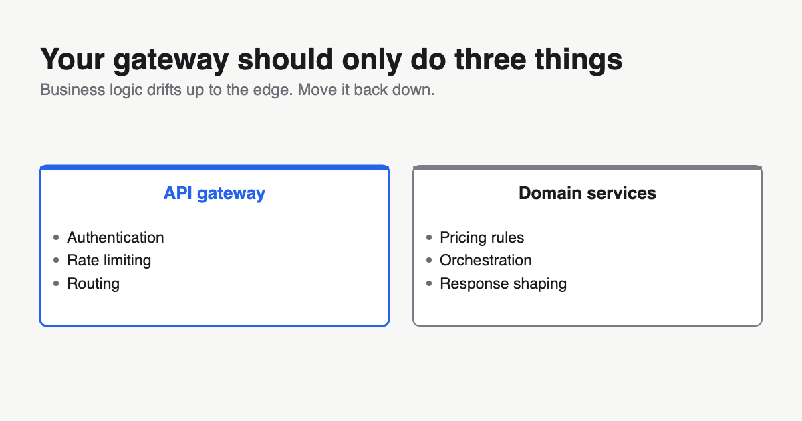
</p>

## Gallery

Figures are **inline by default**: no drawn title, so they sit under your article's
own heading (the takeaway becomes the SVG `<title>` and your alt text). Add
`--show-title` for a slide or a social card. Each image below was compiled from a
short JSON spec. The theme shown is the one that suits that diagram best; any of the
[six themes](#themes) works.

### Architecture

<p align="center">
  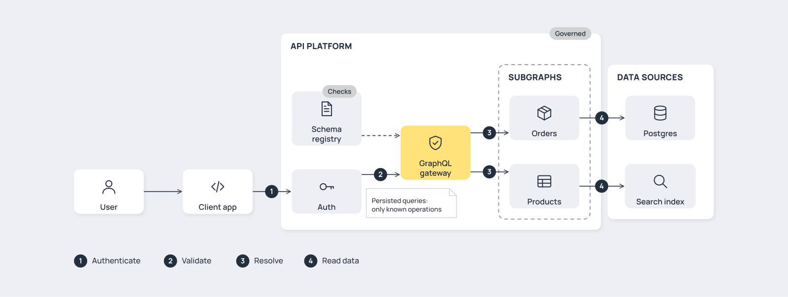
  <br/><sub>Gateway architecture (studio): Graphviz lays it out, the theme paints it; numbered steps and a legend give the order.</sub>
</p>
<p align="center">
  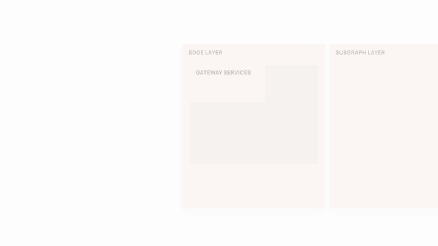
  <br/><sub>Layered platform with a PowerPoint-style build (coral): <code>diagram-animate --preset build</code>.</sub>
</p>

### Cards

<table>
  <tr>
    <td width="50%">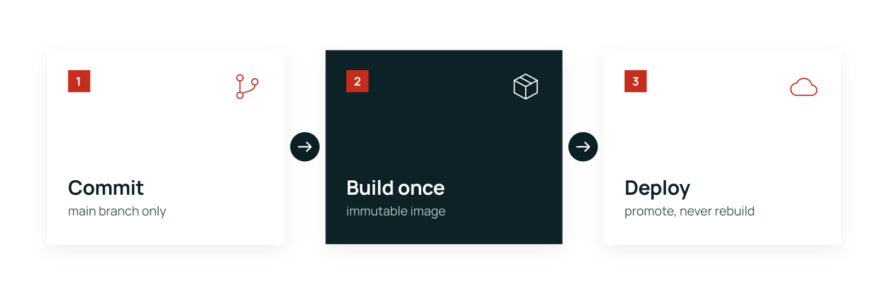<br/><sub><b>flow</b>: steps in order</sub></td>
    <td width="50%">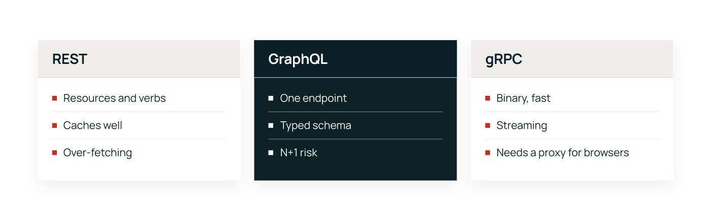<br/><sub><b>compare</b>: 2-3 options side by side</sub></td>
  </tr>
  <tr>
    <td colspan="2">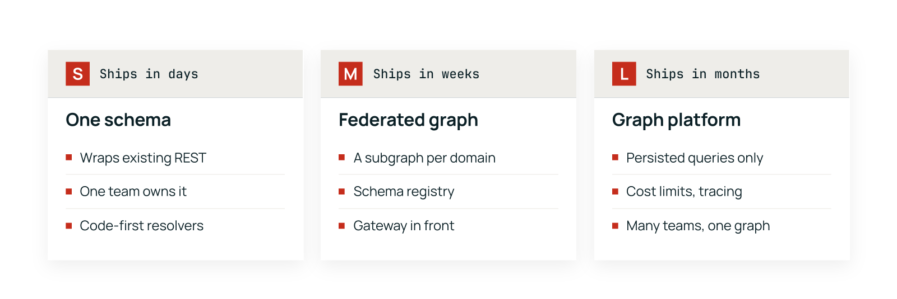<br/><sub><b>tiers</b>: compare with badges and kickers</sub></td>
  </tr>
  <tr>
    <td colspan="2">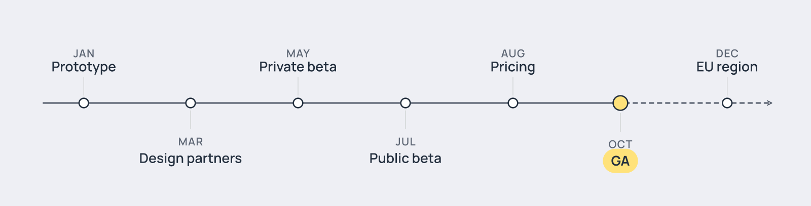<br/><sub><b>timeline</b>: solid up to the highlight, dashed after</sub></td>
  </tr>
  <tr>
    <td width="50%">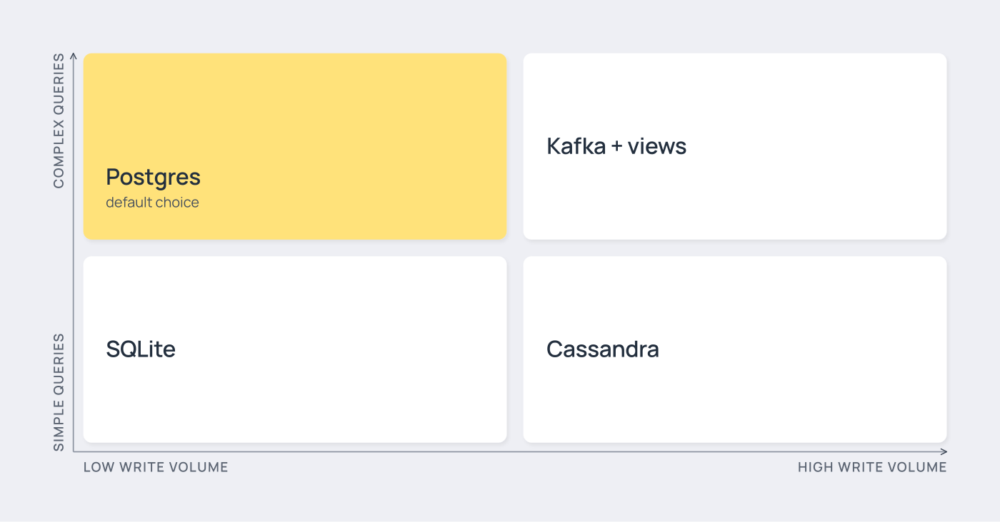<br/><sub><b>grid</b>: a 2×2 trade-off</sub></td>
    <td width="50%"><sub>Also: <b>stack</b> (layers), <b>hub</b> (center + satellites), <b>hub-bus</b>, <b>matrix</b>, and slide variants with chips and a takeaway bar. See <a href="skills/illustration-draw/">illustration-draw</a>.</sub></td>
  </tr>
</table>

### Explainers and animation

<p align="center">
  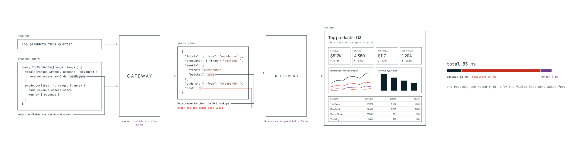
  <br/><sub>Pipeline explainer (<code>pipeline_svg.py</code>): payloads, stages, the result and the timing in one strip.</sub>
</p>
<p align="center">
  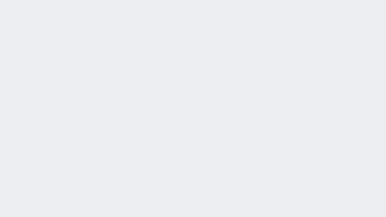
  <br/><sub>The same explainer, animated: the camera walks it one stage at a time (studio).</sub>
</p>
<p align="center">
  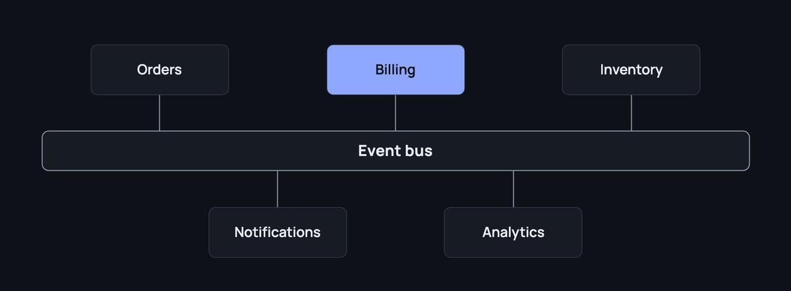
  <br/><sub>Any compiled SVG reveals in reading order (midnight).</sub>
</p>

### Diagrams as code

<table>
  <tr>
    <td width="50%">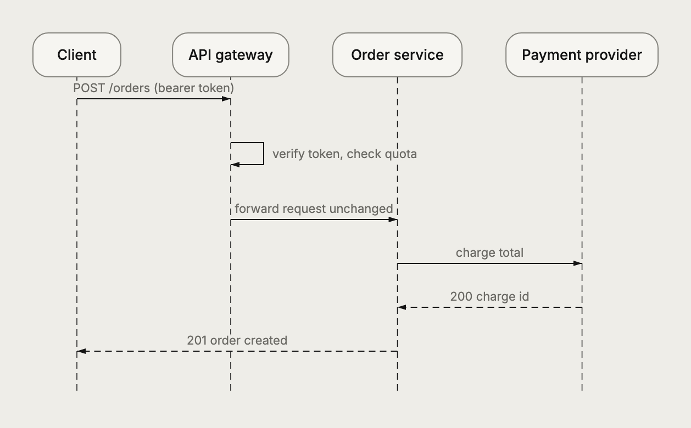<br/><sub>Mermaid, rendered with beautiful-mermaid in the theme</sub></td>
    <td width="50%">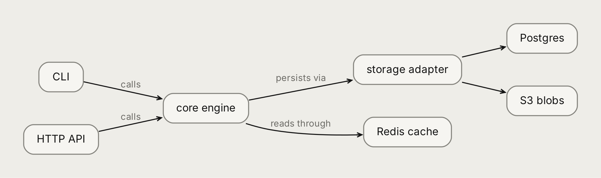<br/><sub>Graphviz DOT, same tokens</sub></td>
  </tr>
</table>

### Standard sizes

<table>
  <tr>
    <td width="60%">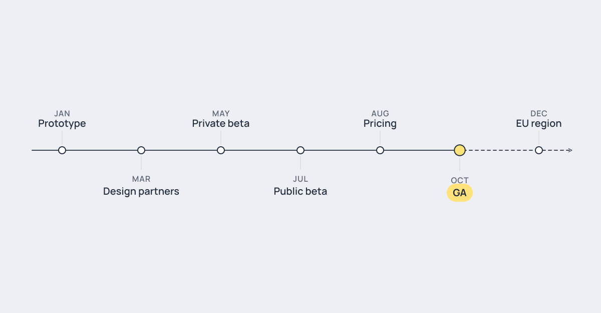<br/><sub><code>--canvas social</code> 1200×627</sub></td>
    <td width="40%">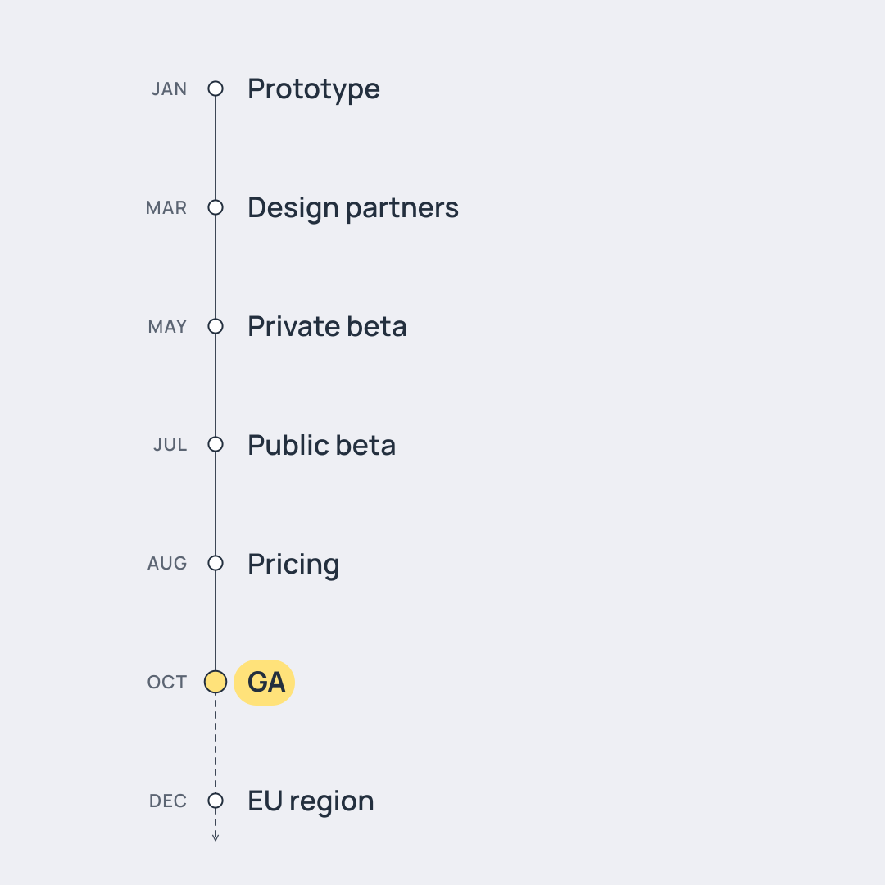<br/><sub><code>--canvas square</code> 1080×1080 reflows</sub></td>
  </tr>
</table>

Cards compile to `social` 1200×627, `square` 1080×1080 or `wide` 1920×1080 and reflow
to each size (square turns timelines vertical and comparisons into rows). Without
`--canvas`, a figure is as tall as its content. Architecture, explainers and Mermaid
keep their natural size; `--canvas` fits them onto a preset and warns when text would
drop under 12 px. Animations pad to the same presets (`animate.py --canvas`).

### Beyond these types: diagram-design

<table>
  <tr>
    <td width="55%">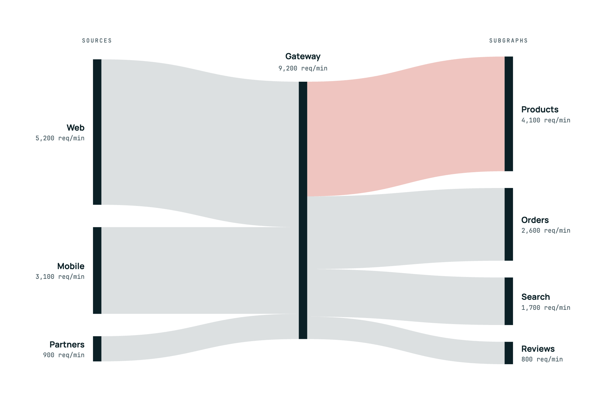<br/><sub>Sankey</sub></td>
    <td width="45%">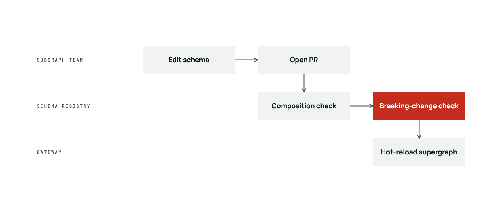<br/><sub>Swimlane</sub></td>
  </tr>
</table>

Types these skills don't draw (swimlane, org chart, Venn, funnel, treemap, heatmap,
charts, Gantt, Sankey, …) are routed to
[diagram-design](https://github.com/cathrynlavery/diagram-design), in the same theme:
`to_diagram_design.py` exports the theme as its profile.

## Quick start

```bash
npx skills add Paldom/diagram-skills
```

Then either give your agent the whole job:

```text
/illustrate LinkedIn visual: gateways should only do auth, rate limiting and routing
```

or ask for one step in plain English and the matching skill activates on its description:

```text
which diagram format fits explaining our event-driven order pipeline?
add a mermaid flowchart of the deploy pipeline to the README
make a social card for my article on cache invalidation
is docs/architecture.svg readable, or too busy?
```

What you need on the machine: Python 3 (the scripts are stdlib-only). Optional, used
when present: Graphviz `dot` (architecture diagrams, styled DOT), an SVG
rasterizer (`rsvg-convert`, `resvg`, Chrome, or macOS QuickLook) to look at
renders, Node ≥ 22.12 + Chrome + ffmpeg for beautiful-mermaid exports and
GIF/MP4 animation, `mmdc` for GitHub-faithful Mermaid renders, and
[`acpx`](https://github.com/openclaw/acpx) with a logged-in Claude Code or Codex
to draw in a separate model session. npm packages are pinned by lockfile and
installed only when you pass `--allow-install`; nothing is sent to hosted
renderers.

### Optional: AI-generated 3D line-art icons

The 35 built-in outline icons are procedural and always match the design
system. For a subject they do not cover, `illustration-draw` can ask a Gemini
image model (Nano Banana Pro, `gemini-3-pro-image`) for a 3D line-art icon — or
a wide hero illustration — in the design system's colours. It needs an API key:

create a key at [aistudio.google.com/apikey](https://aistudio.google.com/apikey)
and put it in your shell profile, never in the repo —
`echo 'export GEMINI_API_KEY="your-key"' >> ~/.zshrc && source ~/.zshrc`.
Then ask for it ("generate a 3D line icon of a vector database with Gemini",
"a paper-line hero illustration of our data pipeline");
the script refuses to call the API without an explicit `--allow-network`, sends
only the prompt, and the JPEG carries Google's SynthID watermark.

### Other ways to install

```bash
npx skills add Paldom/diagram-skills -a codex -a pi   # target specific agents
gh skill install Paldom/diagram-skills                # GitHub CLI >= 2.90
```

```text
/plugin marketplace add Paldom/diagram-skills
/plugin install diagram-skills@diagram-skills
```

## Skills

| Skill | Ask it when | Invoke |
| --- | --- | --- |
| [illustrate](skills/illustrate/) | You have an idea and want the finished visual: brief → format → drawn in a subagent → reviewed | `/illustrate <idea>` |
| [diagram-brief](skills/diagram-brief/) | "which diagram format fits…", "should this be mermaid or an illustration?", "brief a visual for…" | `/diagram-brief` |
| [mermaid-draw](skills/mermaid-draw/) | "add a flowchart to the README", "sequence diagram of the login flow", "DOT graph of the dependencies" | `/mermaid-draw` |
| [illustration-draw](skills/illustration-draw/) | "social card for my article", "slide visual of the three layers", "LinkedIn image comparing REST and gRPC" | `/illustration-draw` |
| [diagram-review](skills/diagram-review/) | "is this diagram readable?", "critique docs/arch.svg", "does this look like AI slop?" | `/diagram-review` |
| [diagram-design-system](skills/diagram-design-system/) | "make our diagrams on-brand", "design system from my moodboard folder", "switch to the coral theme" | `/diagram-design-system` |
| [diagram-animate](skills/diagram-animate/) | "animate this diagram as a GIF", "camera pan across the pipeline", "MP4 of the flow step by step" | `/diagram-animate` |

## How they compose

`/illustrate` runs the engines in order; each also works alone.

1. **[Required]** `diagram-brief` writes the takeaway, the few entities, and the
   route: Markdown destinations get Mermaid, feeds and slides get a compiled
   SVG, illustration-grade work is handed to Claude Design or FigJam.
2. **[Required]** `mermaid-draw` or `illustration-draw` produces the artifact.
   Mermaid gets a pinned config, quoted labels, a node cap, and a
   lint → parser → render loop. Illustrations are compiled from a small JSON
   spec onto a fixed grid, so the model never places a coordinate.
3. **[Required]** `diagram-review` lints, renders at delivery and feed size, and
   runs an analyze-then-judge checklist against the brief. It returns PASS,
   FIX with the exact edits, or REDRAW with the split — never a score.
4. **[Optional]** A second model reviews through `acpx`, ranking candidates
   rather than scoring them.
5. **[Optional]** `diagram-animate` turns the reviewed SVG into an animated SVG,
   GIF, and MP4: reveal in reading order, connectors that draw, badges that
   pop, and a camera pan for wide pipelines.

Underneath all of them sits **one design system**. `design-system.md` holds the
tokens (palette, fonts, radius, borders, a subtle neumorphic lift, icon style,
motion) and the prose rules; every renderer, the lint and the animator read
it. Point at another file and everything restyles on the next render:

```text
/diagram-design-system build our diagram design system from ./moodboard
draw the architecture of the agent gateway using ./brand/design-system.md
```

Or set it once: `export DIAGRAM_DESIGN_SYSTEM=~/brand/design-system.md`, or drop
a `design-system.md` into the project root.

For looks this repo does not draw itself, the router hands off to three
reference skills — **diagram-design** (editorial), **archify** (light,
interactive) and **drawio-skill** (editable) — and tells each how to take the
same design system.

## Themes

Six themes ship; each is one short Markdown file that lists only what it
changes from Studio.

| Theme | Look | Highlight |
| --- | --- | --- |
| `studio` (default) | cool grey canvas, white borderless cards, outline icons in tiles, a subtle neumorphic lift | pale-yellow card behind dark ink |
| `studio-ink` | Studio, six lines long — the smallest custom-theme example | ink card, white text |
| `paper-line` | warm paper, hairline borders, curved connectors, isometric line icons, flat | ink-inverted card (black, paper text) |
| `coral` | the slide language: navy type, red lede, square white cards with a soft shadow, coral row headers, square badges, disc arrows, mono labels | navy card, white text |
| `coral-blocks` | solid salmon blocks in a peach group, navy connectors, red step badges | navy card, white text |
| `midnight` | near-black canvas, slate cards with hairlines, flat | periwinkle card, dark text |

<p align="center">
  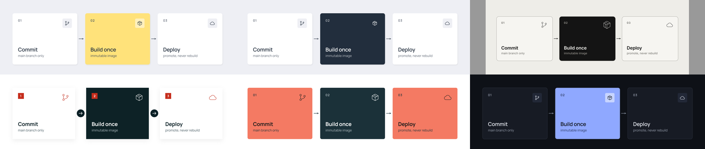
</p>

Pick one by name anywhere a design system is accepted — `--design-system coral`,
`DIAGRAM_DESIGN_SYSTEM=midnight`, or `"extends": "paper-line"` inside another
theme.

**Add your own.** Copy the closest theme, keep the `"extends"` line, and change
only the tokens you need — a brand variant is often six lines:

````markdown
# Design system: acme
```design-tokens
{ "name": "acme", "extends": "studio",
  "color": { "accent": "#FFD9A8", "ink": "#1D1B2E" },
  "type": { "sans": "'IBM Plex Sans', Helvetica, Arial, sans-serif" } }
```
````

Save it as `themes/acme.md` in your project (or in `~/.config/diagram-skills/themes/`,
or any folder listed in `$DIAGRAM_THEMES`) and it resolves by name like the
built-in ones. Or ask for it: `/diagram-design-system make a theme from ./moodboard`
measures a moodboard folder and writes the file for you. Every theme is checked on
load — unknown keys and text below WCAG 4.5:1 contrast are errors, not warnings.

A paste-ready `/goal` that runs the pipeline over a batch of ideas is in
[docs/setup-prompt.md](docs/setup-prompt.md).

## Repository structure

```
skills/                  # distributed skills, one folder per skill (SKILL.md + evals/ + scripts/ + references/)
docs/                    # authoring guide, eval methodology, README standard, deployment, setup prompt
scripts/                 # the gate: validator, eval scorer, self-checks
skills.sh.json           # skills.sh repo-page customization (groupings)
.claude/                 # agentic dev setup: hooks + bundled add-skill / publish-repo skills
.claude-plugin/          # plugin + marketplace manifests (makes this repo installable)
.local/                  # gitignored working area: sources, research, PROMPT.md
```

## Working on this repo with an agent

This repo is agent-native: canonical agent instructions live in
[AGENTS.md](AGENTS.md) (CLAUDE.md imports it), hooks validate and lint every write,
`make check` runs the full gate, and CI enforces the same on every PR. The bundled
`add-skill` skill walks the eval-first authoring workflow in
[docs/skill-authoring.md](docs/skill-authoring.md); the README shape is
[docs/readme-standard.md](docs/readme-standard.md). `make hooks` installs the
commit-time layer. Maintainers drive sessions with their own gitignored
`.local/PROMPT.md`.

## Contributing

Contributions welcome — see [CONTRIBUTING.md](CONTRIBUTING.md) for the skill-proposal
process, the authoring workflow, and the PR checklist. Please note the
[Code of Conduct](CODE_OF_CONDUCT.md).

## Support

Questions, ideas, or something not working? Start with [SUPPORT.md](SUPPORT.md) —
bugs and skill proposals have [issue templates](../../issues/new/choose), and
security concerns go through [SECURITY.md](SECURITY.md) (never a public issue).

## License

[MIT](LICENSE) © 2026 Paldom

<!-- attribution:start -->
---

[](https://github.com/Paldom/skillskit)

Scaffolded with [skillskit](https://github.com/Paldom/skillskit) — eval-first Agent
Skills tooling. This line is yours to delete; nothing checks for it.
<!-- attribution:end -->
