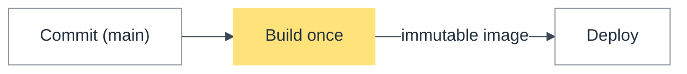
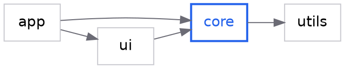

# Mermaid gotchas the lint and the workflow encode

Verified against mermaid.js.org, the npm registry, and GitHub on 2026-09-14.

## Pin the look (Mermaid 12 changed the defaults)

`mermaid@12.0.0` (npm, 2026-09-10) made ELK the bundled default layout engine and
switched the default appearance to `redux-color` / `neo`. Diagrams without a
config pin re-layout and re-color depending on which host renders them. Pin with
YAML frontmatter (the `%%{init}%%` directive form is deprecated since v10.5.0):

Why `theme: base` plus variables: an open Mermaid issue (#3691, since 2022) says
several bundled themes fail WCAG AA contrast in light and/or dark mode. `base` is
the neutral starting point; the variables above are the default design
system's (abridged). `scripts/render_themed.py --config` prints the full block
for whichever design system is active, and the accent is a highlighter fill
behind ink, never a coloured outline or text.

Hosts lag: GitHub renders Mermaid natively but bundles its own version, so avoid
the newest diagram types (use case, swimlane, Venn) in READMEs, and remember a
host outage in early September 2026 broke all Mermaid rendering for days —
commit the source, not a screenshot.

## Syntax that breaks the parser

| Idiom | Rule (mermaid.js.org/syntax/flowchart.html) |
| --- | --- |
| `A[Start (main)]` | punctuation in a label must be quoted: `A["Start (main)"]` |
| `end[...]`, `--> end` | lowercase `end` as a node id breaks the flowchart; use `End` or `END` |
| `A -> B` in a flowchart | `->` is not a flowchart arrow; use `-->` (in `sequenceDiagram`, `->` *is* valid) |
| `graph TD` | legacy alias of `flowchart`; prefer `flowchart` |
| `%%{init: ...}%%` | deprecated directive; use the `config:` frontmatter |
| Unicode `%`, `€`, `£` in pie values | quote or spell out; upstream bug reports exist |

Accessibility: `accTitle: <one line>` and `accDescr: <one line>` (or `accDescr {
... }` multi-line) — mermaid.js.org/config/accessibility.html.

## Complexity caps (lint defaults)

- Flowchart: warn above 12 nodes / 20 edges, error above 25 / 40.
- Sequence: warn above 7 participants, error above 9; warn above 40 messages.
- Above the cap: split by level (context → container → component) or by phase.
  The evidence: on PlanarBench edge count predicts model failure far better than
  vertex count (r = −0.85 vs −0.47, arXiv 2606.02010); dense edges are what
  turns a valid diagram into arrow soup.
- Sequence diagrams, not flowcharts, for anything with more than two parties
  exchanging messages over time.

## Validation ladder

1. `mermaid_lint.py` (in `diagram-review`): the idioms above, caps, config pin,
   accessibility, one accent, generic edge labels. Milliseconds, no install.
2. `npx -y @probelabs/maid@0.0.29 file.mmd` — browser-free parser. Exit 0 = no
   errors, 1 = at least one error (warnings do not fail). `--fix` applies safe
   fixes (`->` → `-->`, inner quotes); `--format json` for machines. Validates
   flowchart, sequence, pie, class, state; **ER, gantt, journey and the rest
   pass through as "valid"** — say "unvalidated" for those.
3. `mmdc -i file.mmd -o out.svg` — `@mermaid-js/mermaid-cli` 11.17.0, the
   reference renderer (Puppeteer + Chromium). `render.py --allow-download` uses
   the pinned npx build when it is not installed. Read the SVG/PNG afterwards.
4. Never paste private diagrams into kroki.io or the Mermaid live editor: GitLab's
   own docs warn "Kroki diagrams are not stored on GitLab, so standard GitLab
   access controls … are not in force" (docs.gitlab.com/administration/integration/kroki/).

Repair loop: feed the exact parser error back, fix, re-validate — at most three
turns, then regenerate from the brief instead of patching a patch.

## Graphviz DOT (trees and dependency graphs)

`dot -Tsvg deps.dot -o deps.svg` (graphviz.org/doc/info/command.html). Graphviz
owns the whole layout, which is why DOT gets the fewest complaints on large
graphs; if `dot` is not installed, say the DOT is unvalidated or fall back to a
≤ 12-node Mermaid flowchart. Above ~20 nodes prune to the subgraph that carries
the point — nobody reads a hairball.
